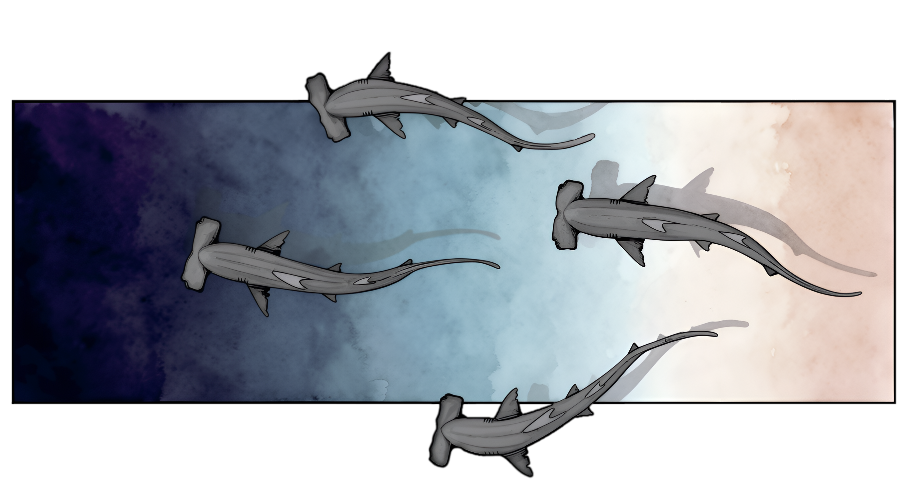

# Hi, I'm Henry

**Software Engineer · Python · Go · TypeScript**

Building containerised, cloud-native services and data pipelines.
Final-year BSc (Hons) Computing & IT — on track for First-Class Honours.

---

## About Me

- 🎓 Final-year Computing & IT student (Data Structures & Algorithms, Machine Learning, OOP, Databases, Software Engineering, Cloud Computing)
- 💼 Seven years in commercial roles — database administration, analytics and marketing — before moving into software engineering
- 🔧 Focused on backend services in **Go** and **Python**, data engineering, and cross-platform apps with **React Native**
- 📚 Currently learning **Kubernetes** and **Terraform**
- 🌿 Some of my work lives in **private repositories** — highlights below

## 🚀 Featured Projects

| Project | Stack | What it is |
|---------|-------|------------|
| [**Study Session**](https://github.com/kiwayu/study-app) | Go · PostgreSQL · OAuth2 · Docker | Multi-user Pomodoro & task manager: Google/GitHub OAuth2 sign-in, JWT with refresh-token rotation, rate limiting, CSRF protection, layered handler/middleware/repository architecture. Also ships as a WebView2 desktop app. |
| [**E-Commerce Analytics Pipeline**](https://github.com/kiwayu/e-commerce-analytics-pipeline) | Python · Airflow · dbt · PySpark | Warehouse pipeline landing a public e-commerce dataset in PostgreSQL via Airflow DAGs, modelled through dbt staging/intermediate/mart layers, validated with Great Expectations. One Docker Compose command to run. |
| [**BookBrain**](https://github.com/kiwayu/book-app) | React Native · TypeScript · Expo · SQLite | Offline-first personal library app for iOS, Android and web from one codebase — collections, progress tracking and multi-criteria search, built with Zustand, React Query and NativeWind. |
| [**NudibranchID.io**](https://github.com/kiwayu/NudibranchID.io) | Python | Image-comparison tool to help identify nudibranch species against a reference dataset. |
| **Dive Log** 🔒 | Go · PostgreSQL · React Native · PowerSync · AWS | *In progress* — commercial, offline-first dive log for iOS, Android and web that keeps working on a boat with no signal. Containerised AWS deployment planned. |
| **AdBudget Copilot** 🔒 | Python · FastAPI · React | Analytics tool that turns campaign CSVs into plain-English budget-reallocation recommendations, with a React dashboard for scenario comparison. |

## 🛠️ Tech Stack

### Languages

### Backend & Data

### Cloud & DevOps

-326CE5?style=for-the-badge&logo=kubernetes&logoColor=white)
-7B42BC?style=for-the-badge&logo=terraform&logoColor=white)

### Frontend & Mobile

## 📊 GitHub Metrics

## 🎯 Current Focus

- 🌊 Shipping the **Dive Log** app — offline-first sync with PowerSync, Go backend on AWS
- 🏗️ Data modelling and warehouse architecture with dbt and Airflow
- ☸️ Working towards Kubernetes and Terraform proficiency
